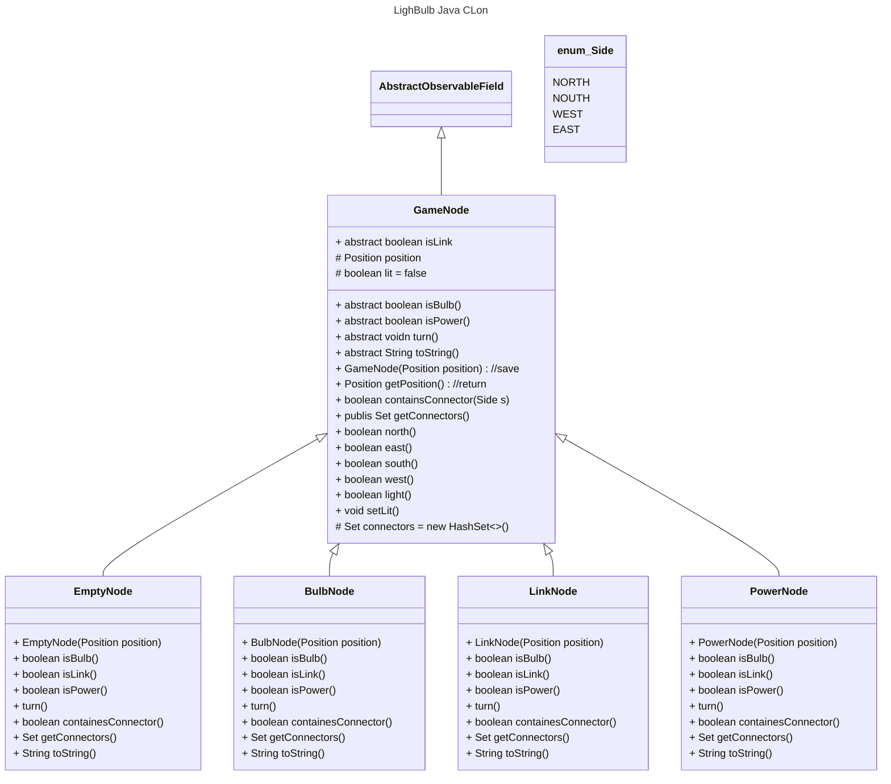

### Visibility 
Defined by [marmaid.js.org/syntax/class](https://mermaid.js.org/syntax/classDiagram.html)
 - `+` Public
 - `-` Private
 - `#` Protected

```mermaid
---
title: LighBulb Java CLon
---
classDiagram 
    class AbstractObservableField

    class GameNode{
        + abstract boolean isBulb()
        + abstract boolean isLink
        + abstract boolean isPower()
        + abstract voidn turn()
        + abstract String toString()

        + GameNode(Position position) //save
        + Position getPosition() //return 
        + boolean containsConnector(Side s)
        + publis Set<Side> getConnectors()

        + boolean north()
        + boolean east()
        + boolean south()
        + boolean west()
        + boolean light()
        + void setLit()

        # Position position
        # boolean lit = false
        # Set<Side> connectors = new HashSet<>()
    
    }

    class BulbNode{
        + BulbNode (Position position)
        + boolean isBulb()
        + boolean isLink()
        + boolean isPower()
        + turn()
        + boolean containesConnector()
        + Set<Side> getConnectors()
        + String toString()
    }

    class EmptyNode{
        + EmptyNode (Position position)
        + boolean isBulb()
        + boolean isLink()
        + boolean isPower()
        + turn()
        + boolean containesConnector()
        + Set<Side> getConnectors()
        + String toString()
    }

    class LinkNode{
        + LinkNode (Position position)
        + boolean isBulb()
        + boolean isLink()
        + boolean isPower()
        + turn()
        + boolean containesConnector()
        + Set<Side> getConnectors()
        + String toString()
    }

    class PowerNode{
        + PowerNode (Position position)
        + boolean isBulb()
        + boolean isLink()
        + boolean isPower()
        + turn()
        + boolean containesConnector()
        + Set<Side> getConnectors()
        + String toString()
    }


    class enum_Side{
        NORTH
        NOUTH
        WEST
        EAST
    }
    AbstractObservableField <|-- GameNode
    GameNode<|--EmptyNode
    GameNode<|--BulbNode
    GameNode<|--LinkNode
    GameNode<|--PowerNode
```