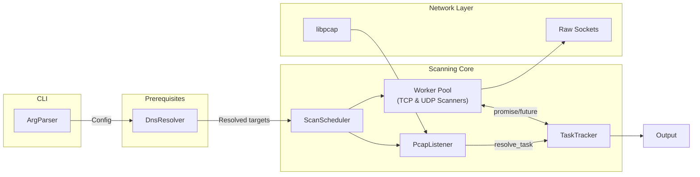
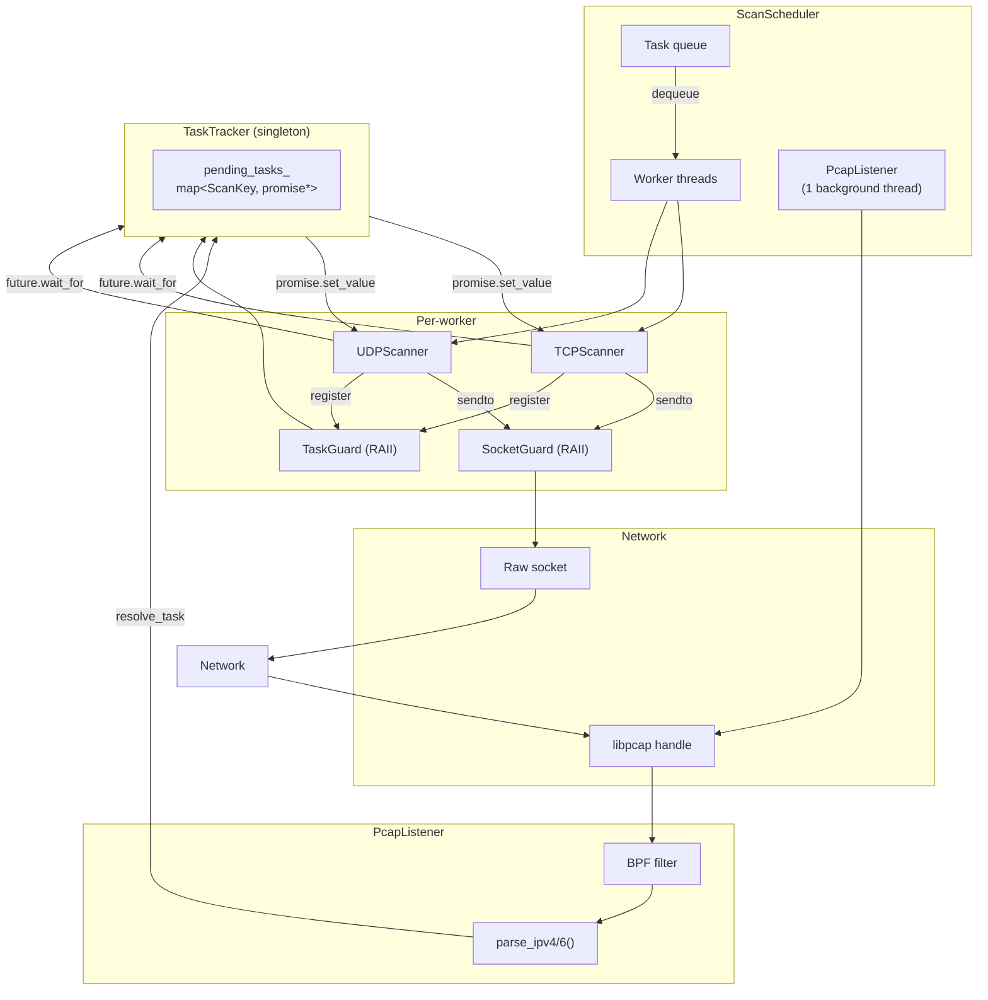

# Project 1 - L4 Scanner 
*author: Peter Stáhl (xstahl01)*

TCP/UDP port scanner using raw sockets and libpcap. Supports IPv4 and IPv6.

---

## Table of Contents 
- [Build and Run](#build-and-run)
- [Architecture](#architecture)
- [Testing](#testing)
- [Known Limitations](#known-limitations)
- [References](#references)
---
## Build and Run

### Requirements

- Linux (raw socket and libpcap support required)
- C++20 compiler (g++ or clang++)
- libpcap development headers (`libpcap-dev`)
- Run with root privileges (raw sockets require `CAP_NET_RAW`)

### Build

```bash
make                    # build -> ./ipk-L4-scan
make NixDevShellName    # prints: c
make test               # run tests
```

### Usage

```
./ipk-L4-scan -i INTERFACE [-t PORTS] [-u PORTS] HOST [-w TIMEOUT]
./ipk-L4-scan -i
./ipk-L4-scan -h | --help
```

#### Options

| Option | Description |
|---|---|
| `-i INTERFACE` | Network interface (e.g. `eth0`) |
| `-t PORTS` | TCP ports (e.g. `22`, `1-1024`, `22,80,443`) |
| `-u PORTS` | UDP ports (e.g. `53,67`) |
| `-w TIMEOUT` | Timeout in milliseconds (default: `1000`) |
| `-h`, `--help` | Print usage and exit with code 0 |
| `-i` (alone) | Print active network interfaces and exit with code 0 |

Arguments may appear in any order. `HOST` is either a hostname or an IPv4/IPv6 address literal.

### Examples

```bash
# TCP scan on ports 80, 443, 8080 with custom timeout
sudo ./ipk-L4-scan -i eth0 -w 2000 -t 80,443,8080 www.vutbr.cz

# UDP scan on IPv6 target
sudo ./ipk-L4-scan -i eth0 -u 53,67 2001:67c:1220:809::93e5:917

# Combined TCP and UDP scan on localhost
sudo ./ipk-L4-scan -i lo -t 21,22,143 -u 53,67 localhost
```
---

## Architecture
### Program Overview


### Scanning Module


I documented prototyping as mermaid graphs, you can check out [here](/docs/prototypes.md)


### Design decisions

- **`IP_HDRINCL` for IPv4, kernel header for IPv6** — standard Linux raw socket asymmetry - IPv6 `SOCK_RAW` builds the IP header automatically.

- **`TaskTracker` promise/future bridge** — decouples send (worker thread) from receive (pcap thread) without polling. `TaskGuard` RAII ensures no dangling `promise*` survives an exception.

- **Thread count `clamp(hw×2, 4, 32)`** — reasonable parallelism for multicore machines with upper and lower bounds to avoid starving or overwhelming the system.

- **Interface IP cache** — `getifaddrs` is an expensive syscall : results are cached in static map behind mutex after the first call.

- **Atomic ephemeral port counter** — collision-free source port selection across worker threads without lock, cycling through the IANA range 49152–65535.

- **`ArgParser` is syntax-only** — no DNS resolution inside the parser --> keeps bad-argument errors and DNS failures attributed separately.

- **Extensive use of RAII** — `SocketGuard` and `TaskGuard` ensure all resources (file descriptors, tracker registrations) are cleaned up deterministically on both normal and exception paths.

--- 

## Testing

### How to Run

```bash
make test        # no root required — tests do not send packets
```
### Environment
- OS: Manjaro Linux (x86\_64), and verified inside Nix `c` devShell (reference environment)
- Compiler: g++ (C++20)
- Framework: Catch2 (amalgamated build, included in `tests/catch2_include/`)


### What & why
 
| Suite | What | Why |
|---|---|---|
| `[arg_parser]` | Valid args, port ranges, out-of-range ports, duplicate hosts | Parser is the first line of input validation |
| `[dns]` | `localhost` resolves to `127.0.0.1`/`::1`, invalid host throws | Ensures dual-stack resolution and proper error propagation |
| `[tracker]` | Register → resolve, register → timeout removal | Core of the promise/future bridge; a bug here causes hangs |
| `[tracker][raii]` | `TaskGuard` cleans up on scope exit with and without resolve | Verifies no dangling `promise*` survives an exception path |
| `[scanner_base]` | RFC 1071 checksum: known input → expected output | Incorrect checksums cause all packets to be silently dropped |
| `[pcap]` | ICMP source IP tracking — inner dst used, not outer src | Regression for a real bug: UDP results mapped to wrong host |
| `[tcp_scanner]` | Packet size, SYN flag, dest IP, `tot_len` field | Verifies packet structure before anything hits the wire |
| `[udp_scanner]` | Packet size, protocol field, dest IP, `tot_len` field | Same — UDP header layout and length correctness |
| `[scan_key]` | Equality and hash contract for `ScanKey` | Wrong hash → collisions in `TaskTracker` map → misrouted results |
| `[application]` | Missing host/interface/ports → `EXIT_FAILURE`, bad DNS → `EXIT_FAILURE` | End-to-end validation path without needing root |
 
All suites run without root privileges and without sending any packets to the network.

<details>
<summary><span style="font-size:1.5em;"> Test output</span></summary>

```bash
[peter@peter-20qks1lc1m IPK]$ make test
Compiling src/dns/dns_resolver.cpp...
g++ -std=c++20 -Wall -Wextra -Wpedantic -g -Isrc -Isrc/dns -Isrc/scanning -Isrc/app -Isrc/utils -c src/dns/dns_resolver.cpp -o build/dns/dns_resolver.o
Compiling src/scanning/scanner_base.cpp...
g++ -std=c++20 -Wall -Wextra -Wpedantic -g -Isrc -Isrc/dns -Isrc/scanning -Isrc/app -Isrc/utils -c src/scanning/scanner_base.cpp -o build/scanning/scanner_base.o
Compiling src/scanning/scan_scheduler.cpp...
g++ -std=c++20 -Wall -Wextra -Wpedantic -g -Isrc -Isrc/dns -Isrc/scanning -Isrc/app -Isrc/utils -c src/scanning/scan_scheduler.cpp -o build/scanning/scan_scheduler.o
Compiling src/scanning/udp_scanner.cpp...
g++ -std=c++20 -Wall -Wextra -Wpedantic -g -Isrc -Isrc/dns -Isrc/scanning -Isrc/app -Isrc/utils -c src/scanning/udp_scanner.cpp -o build/scanning/udp_scanner.o
Compiling src/scanning/pcap_listener.cpp...
g++ -std=c++20 -Wall -Wextra -Wpedantic -g -Isrc -Isrc/dns -Isrc/scanning -Isrc/app -Isrc/utils -c src/scanning/pcap_listener.cpp -o build/scanning/pcap_listener.o
Compiling src/scanning/tcp_scanner.cpp...
g++ -std=c++20 -Wall -Wextra -Wpedantic -g -Isrc -Isrc/dns -Isrc/scanning -Isrc/app -Isrc/utils -c src/scanning/tcp_scanner.cpp -o build/scanning/tcp_scanner.o
Compiling src/scanning/task_tracker.cpp...
g++ -std=c++20 -Wall -Wextra -Wpedantic -g -Isrc -Isrc/dns -Isrc/scanning -Isrc/app -Isrc/utils -c src/scanning/task_tracker.cpp -o build/scanning/task_tracker.o
Compiling src/app/application.cpp...
g++ -std=c++20 -Wall -Wextra -Wpedantic -g -Isrc -Isrc/dns -Isrc/scanning -Isrc/app -Isrc/utils -c src/app/application.cpp -o build/app/application.o
Compiling src/utils/arg_parser.cpp...
g++ -std=c++20 -Wall -Wextra -Wpedantic -g -Isrc -Isrc/dns -Isrc/scanning -Isrc/app -Isrc/utils -c src/utils/arg_parser.cpp -o build/utils/arg_parser.o
Compiling src/utils/socket_guard.cpp...
g++ -std=c++20 -Wall -Wextra -Wpedantic -g -Isrc -Isrc/dns -Isrc/scanning -Isrc/app -Isrc/utils -c src/utils/socket_guard.cpp -o build/utils/socket_guard.o
Compiling src/main.cpp...
g++ -std=c++20 -Wall -Wextra -Wpedantic -g -Isrc -Isrc/dns -Isrc/scanning -Isrc/app -Isrc/utils -c src/main.cpp -o build/main.o
Linking ipk-L4-scan...
g++  build/dns/dns_resolver.o  build/scanning/scanner_base.o  build/scanning/scan_scheduler.o  build/scanning/udp_scanner.o  build/scanning/pcap_listener.o  build/scanning/tcp_scanner.o  build/scanning/task_tracker.o  build/app/application.o  build/utils/arg_parser.o  build/utils/socket_guard.o  build/main.o -o ipk-L4-scan -lpcap
Build complete: ./ipk-L4-scan
Compiling and linking tests...
g++ -std=c++20 -Wall -Wextra -Wpedantic -g -Isrc -Isrc/dns -Isrc/scanning -Isrc/app -Isrc/utils tests/test_scanner.cpp build/dns/dns_resolver.o build/scanning/scanner_base.o build/scanning/scan_scheduler.o build/scanning/udp_scanner.o build/scanning/pcap_listener.o build/scanning/tcp_scanner.o build/scanning/task_tracker.o build/app/application.o build/utils/arg_parser.o build/utils/socket_guard.o tests/catch2_include/catch_amalgamated.cpp -o test_scanner -lpcap
tests/test_scanner.cpp: In function ‘void CATCH2_INTERNAL_TEST_18()’:
tests/test_scanner.cpp:109:10: warning: variable ‘found_v6’ set but not used [-Wunused-but-set-variable]
  109 |     bool found_v6 = false;
      |          ^~~~~~~~
tests/test_scanner.cpp: In member function ‘virtual ScanResult TestScanner::scan(const ScanTask&) const’:
tests/test_scanner.cpp:172:37: warning: unused parameter ‘task’ [-Wunused-parameter]
  172 |     ScanResult scan(const ScanTask& task) const override { return {}; }
      |                     ~~~~~~~~~~~~~~~~^~~~
./test_scanner
Randomness seeded to: 3274267715
Usage:
  ipk-L4-scan -i INTERFACE [-t PORTS] [-u PORTS] HOST [-w TIMEOUT]
  ipk-L4-scan -i
  ipk-L4-scan -h | --help

Options:
  -i INTERFACE   Network interface to use
  -t PORTS       TCP ports (e.g. 22,80 or 1-1024)
  -u PORTS       UDP ports (e.g. 53,67 or 1-1024)
  -w TIMEOUT     Timeout in milliseconds (default: 1000)
  -h, --help     Show this help message
Usage:
  ipk-L4-scan -i INTERFACE [-t PORTS] [-u PORTS] HOST [-w TIMEOUT]
  ipk-L4-scan -i
  ipk-L4-scan -h | --help

Options:
  -i INTERFACE   Network interface to use
  -t PORTS       TCP ports (e.g. 22,80 or 1-1024)
  -u PORTS       UDP ports (e.g. 53,67 or 1-1024)
  -w TIMEOUT     Timeout in milliseconds (default: 1000)
  -h, --help     Show this help message
Usage:
  ipk-L4-scan -i INTERFACE [-t PORTS] [-u PORTS] HOST [-w TIMEOUT]
  ipk-L4-scan -i
  ipk-L4-scan -h | --help

Options:
  -i INTERFACE   Network interface to use
  -t PORTS       TCP ports (e.g. 22,80 or 1-1024)
  -u PORTS       UDP ports (e.g. 53,67 or 1-1024)
  -w TIMEOUT     Timeout in milliseconds (default: 1000)
  -h, --help     Show this help message
Usage:
  ipk-L4-scan -i INTERFACE [-t PORTS] [-u PORTS] HOST [-w TIMEOUT]
  ipk-L4-scan -i
  ipk-L4-scan -h | --help

Options:
  -i INTERFACE   Network interface to use
  -t PORTS       TCP ports (e.g. 22,80 or 1-1024)
  -u PORTS       UDP ports (e.g. 53,67 or 1-1024)
  -w TIMEOUT     Timeout in milliseconds (default: 1000)
  -h, --help     Show this help message
===============================================================================
All tests passed (133 assertions in 62 test cases)
```

</details>

### Manual End-to-End Test

**What:** Verify that open, closed, and filtered states are correctly detected for both TCP and UDP against a controlled local listener.

**Why:** Automated unit tests verify structure and logic in isolation; this test exercises the full send→capture→resolve path on a real interface.

**How:** `test_target.py` (in `tests/`) binds TCP/8080 and UDP/9090 on localhost.

**Environment:** Linux loopback interface (`lo`), localhost, run as root.

```bash
# Terminal 1 — start the listener
python3 tests/test_target.py

# Terminal 2 — run the scanner
sudo ./ipk-L4-scan -i lo -t 8080,8081 -u 9090,9091 127.0.0.1
```

**Expected output:**
```
127.0.0.1 8080 tcp open
127.0.0.1 8081 tcp closed
127.0.0.1 9090 udp open
127.0.0.1 9091 udp closed
```

**Actual output** :
```
[peter@peter-20qks1lc1m IPK]$ sudo ./ipk-L4-scan -i lo -t 8080,8081 -u 9090,9091 127.0.0.1
127.0.0.1 9091 udp closed
127.0.0.1 8080 tcp open
127.0.0.1 8081 tcp closed
127.0.0.1 9090 udp open
[peter@peter-20qks1lc1m IPK]$ 

```

Output lines may appear in any order per the specification; order shown above is representative.


---

## References

1. POSTEL, Jon. *RFC 793: Transmission Control Protocol*. IETF, 1981. Available at: https://www.ietf.org/rfc/rfc793.txt

2. EDDY, Wesley. *RFC 9293: Transmission Control Protocol (TCP)*. IETF, 2022. Available at: https://datatracker.ietf.org/doc/html/rfc9293

3. POSTEL, Jon. *RFC 768: User Datagram Protocol*. IETF, 1980. Available at: https://datatracker.ietf.org/doc/html/rfc768

4. POSTEL, Jon. *RFC 791: Internet Protocol*. IETF, 1981. Available at: https://datatracker.ietf.org/doc/html/rfc791

5. DEERING, Steve E. and HINDEN, Bob. *RFC 8200: Internet Protocol, Version 6 (IPv6) Specification*. IETF, 2017. Available at: https://datatracker.ietf.org/doc/html/rfc8200

6. HALL, Brian "Beej". *Beej's Guide to Network Programming*. 2023. Available at: https://beej.us/guide/bgnet/

7. *TCP SYN (Stealth) Scan (-sS)*. Nmap Network Scanning. Available at: https://nmap.org/book/synscan.html

8. NESFIT. *IPK course examples*. Faculty of Information Technology, Brno University of Technology. Available at: https://git.fit.vutbr.cz/NESFIT/IPK-Examples/

9. HINNANT, Howard et al. *Catch2 Unit Testing Framework* [software]. Available at: https://github.com/catchorg/Catch2

10. STÁHL, Peter. *FIT_PROJECTS — prior coursework repository* [own work].
    Available at: https://github.com/stahlgit/FIT_PROJECTS

11. *Port Scanning Techniques — UDP Scan*. Nmap Network Scanning. Available at: https://nmap.org/book/scan-methods-udp-scan.html

12. Claude (Anthropic). AI assistant used for test generation