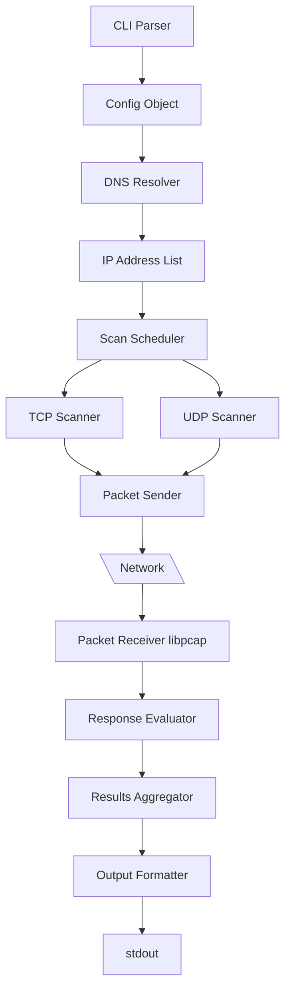
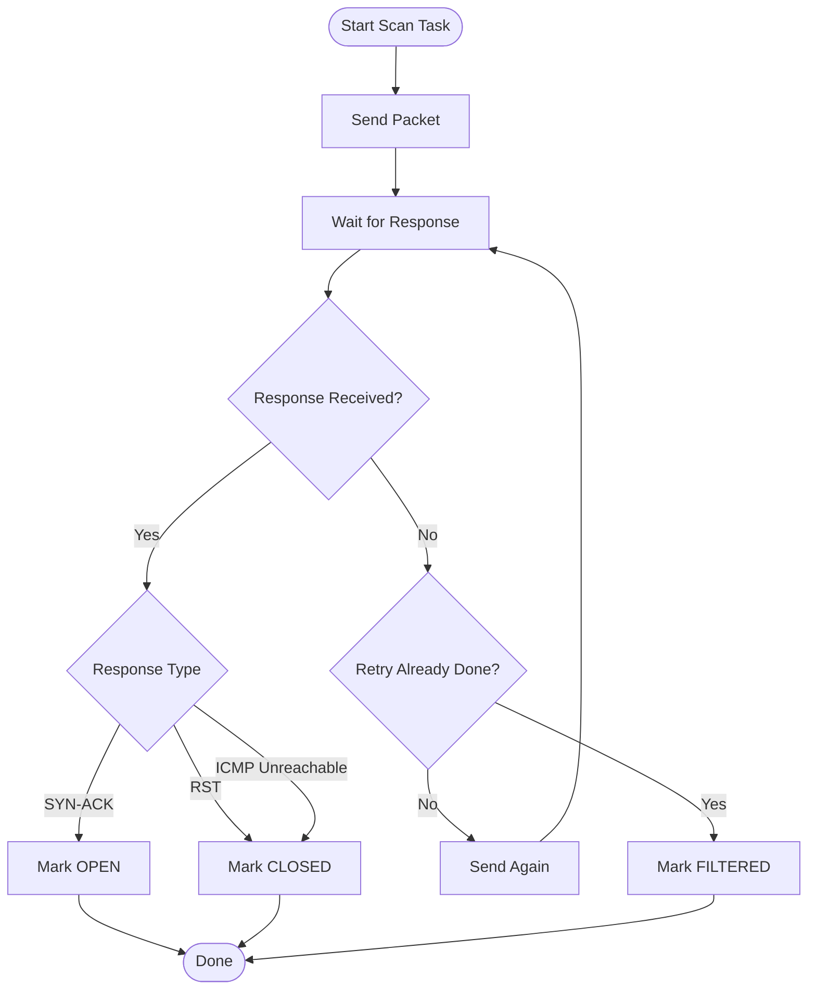
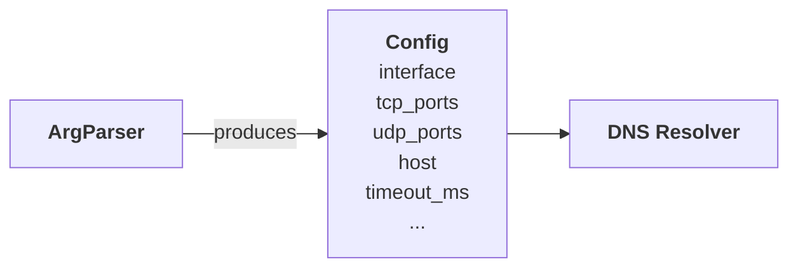
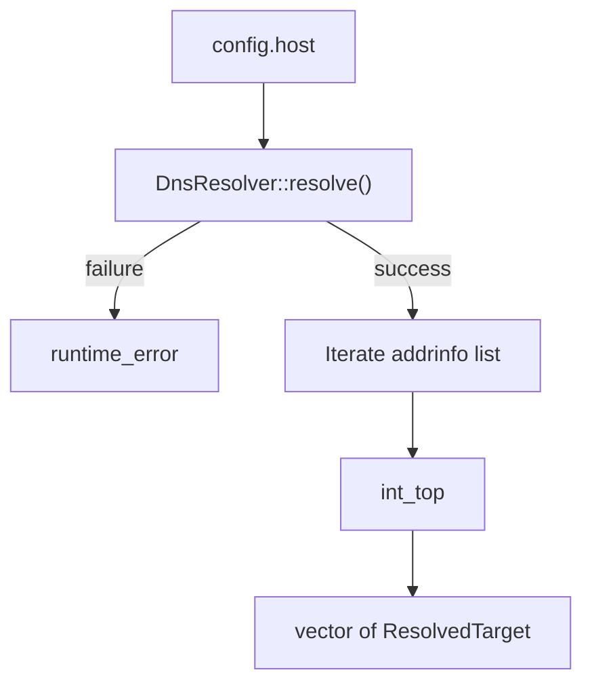
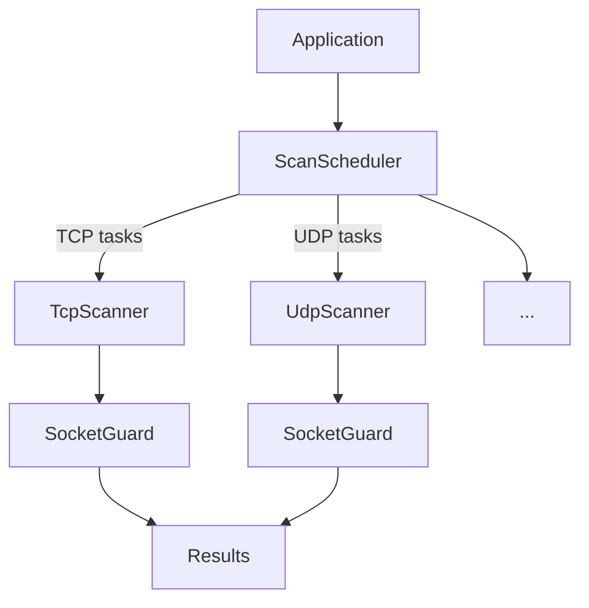
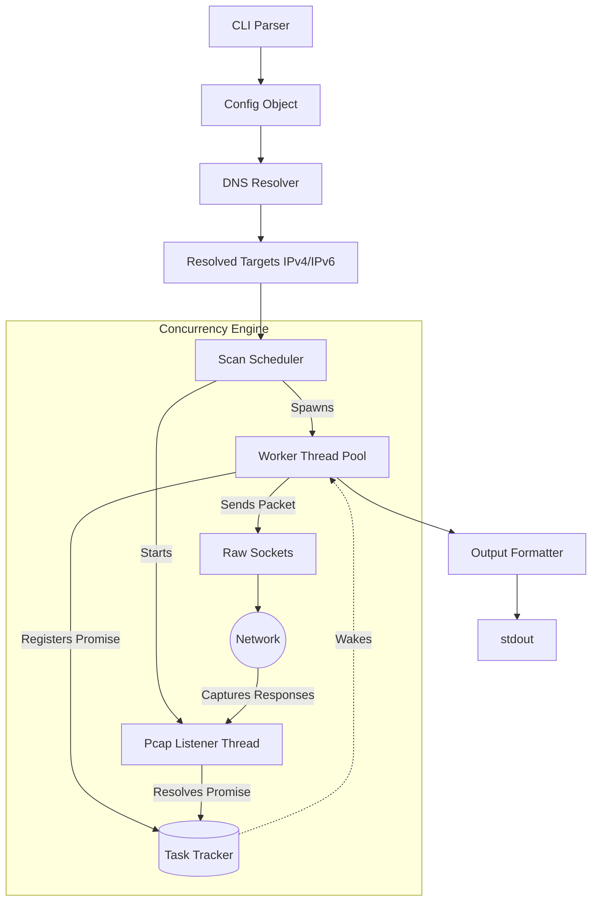
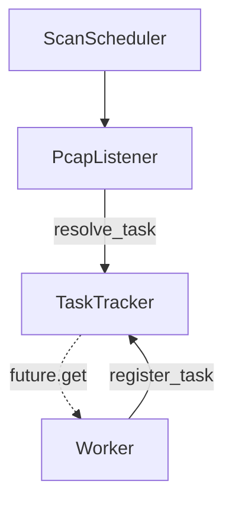

### Prototype
#### High level prototype

#### Flow Prototype

### Architecture concepts 
#### CLI Parser
*NOTE: Separation of Concerns: CLI Parser only checks valid syntax - no DNS resolution inside!*

#### DNS Resolver

#### ScanScheduler

### System Architecture Overview

