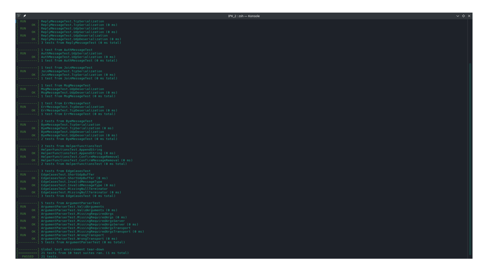
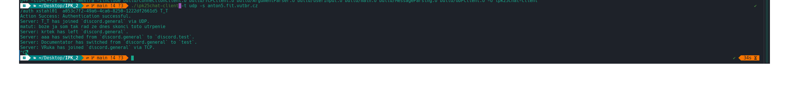
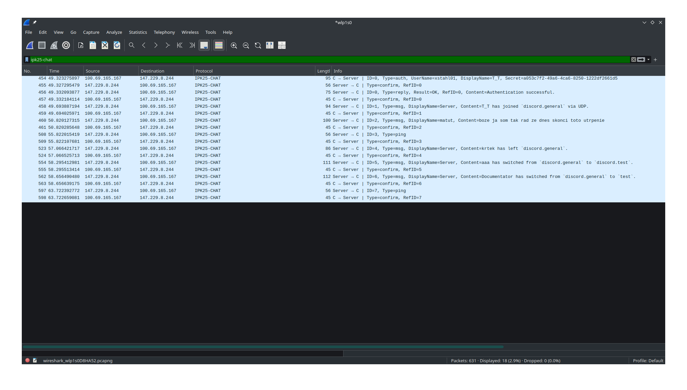
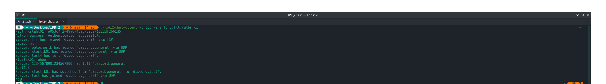
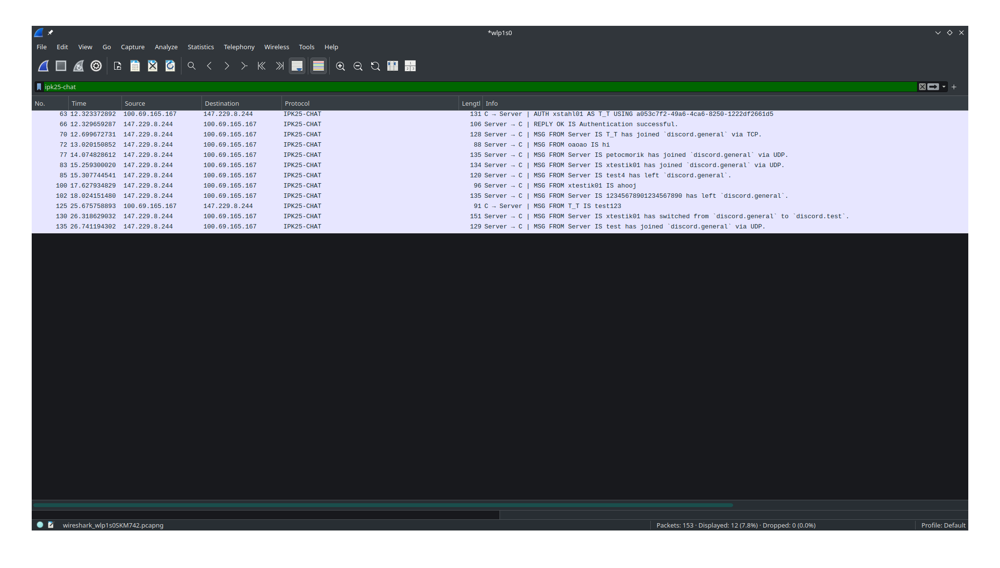

# IPK Project 2: Client for a chat server using the IPK25-CHAT protocol


## Introduction
The goal of this project was to design and  implement Client application that communicate with remove server using IPK25-CHAT protocol


## Launching the application
### Requirements 
#### Build 
- C++ 20
- Makefile
#### Testing
- Google Test (for testing)
#### Docs
- (Markdown with Mermaid rendering)
  
### Build
- ```make``` for building project
  - this create ```ipk25chat-client``` 
-  ```make test``` for building and running tests 
- ```make clean``` for cleaning project directory 

### Run 
Running application correlates with given task.
Examples :
``` ./ipk25chat-client -h ```
``` ./ipk25chat-client -t tcp -s 127.0.0.1```
``` ./ipk25chat-client -t udp -s ipk.fit.vutbr.cz -p 10000```


## Theory and Implemantation 

### Basic Pre-Planning 

1. Implement argument parsing.

2. Build TransportClient (TCP & UDP) with raw send() / recv() working.

3. Write Message constructor/parser for both protocols.

4. Implement a simple FSM in ChatClient.

5. Add command input parsing (handle /auth, /join, /rename, /help).

6. Test against nc (netcat) or the reference server.

### TCP vs UDP 
Application has different strategy for handling communtion via UDP or TCP.
While TCP is reliable connection, where I didn't have to deal with things like packet loss, packet duplication, etc. I had to compose messages in specialized format given by assignment. For specific details, refer to : [IPK Project 2 Repository](https://git.fit.vutbr.cz/NESFIT/IPK-Projects/src/branch/master/Project_2).
On the other hand, with UDP as an unreliable connection, it was necessary to implement explicit message confirmation and retransmission of messages if they were lost. UDP packets also follow a specific structure, defined by the IPK25-CHAT protocol, as described here:[IPK Project 2 Repository](https://git.fit.vutbr.cz/NESFIT/IPK-Projects/src/branch/master/Project_2). 
These facts were the ground logic for building Client application.

### Event-driven communication using poll()
A key part of the client implementation is the use of the poll() system call, which enables the program to handle asynchronous events in a clean and efficient way without relying on multithreading. This approach ensures that the client can react to user input, incoming server messages, and system signals (like SIGINT) in real-time, while maintaining a single, straightforward control flow.

The program defines a set of file descriptors that are monitored using poll():
- Connection Socket — watches for incoming messages from the server.
- Standard Input — allows the user to input chat commands.
- Signal File Descriptor — handles graceful termination when the application receives SIGINT (Ctrl+C) or similar signals.

When the poll() system call detects an event on any of these descriptors, the program decides the appropriate action:
- If the socket has incoming data, it calls the processIncomingMessage() method to parse and handle the message.
- If the standard input is ready, it processes user commands such as /auth, /join, /help, /rename or chat messages.
- If the signal file descriptor indicates a signal was caught, the program initiates a clean shutdown sequence.

This design ensures responsive and orderly communication between the server, user, and operating system, especially when working with both TCP and UDP connections.

### Project Architecture 
#### Representation of Messages:
Each message can serialize (build) and deserialize (extract) message of it's type and it's adjust to align with it's predefined behavior. 

```Mermaid
classDiagram
    class MessageParsing {
        uint16_t messageId

        uint8_t type() 
        void serialize(buffer, protocol)
        bool deserialize(buffer, protocol)
        MessageParsing(messageId)
    }

    class ConfirmMessage {

        uint8_t type()
        void serialize(buffer, protocol)
        bool deserialize(buffer, protocol)
        ConfirmMessage(messageId)
    }

    class ReplyMessage{
        bool result
        uint16_t
        string messageContent

        uint8_t type()
        void serialize(buffer, protocol)
        bool deserialize(buffer, protocol)
    }

    class AuthMessage {
        username
        displayName
        secret

        uint8_t type() 
        void serialize(buffer, protocol)
        bool deserialize(buffer, protocol)
        AuthMessage(username, displayName, secret)
    }

    class JoinMessage {
        channelId
        displayName

        uint8_t type() 
        void serialize(buffer, protocol)
        bool deserialize(buffer, protocol)
        JoinMessage(chanelId, displayName)
    }

    class MsgMessage {
        displayName
        messageContent

        uint8_t type() 
        void serialize(buffer, protocol)
        bool deserialize(buffer, protocol)
        MsgMessage(chanelId, displayName)
    }

    class ErrMessage {
        displayName
        messageContent

        uint8_t type() 
        void serialize(buffer, protocol)
        bool deserialize(buffer, protocol)
        ErrMessage(chanelId, displayName)
    }

    class ByeMessage {

        uint8_t type() 
        void serialize(buffer, protocol)
        bool deserialize(buffer, protocol)
        ErrMessage()
    }

    class PingMessage {

        uint8_t type()
        void serialize(buffer, protocol)
        bool deserialize(buffer, protocol)
        PingMessage(messageId)
    }


    ConfirmMessage --|> MessageParsing 
    ReplyMessage --|> MessageParsing 
    AuthMessage --|> MessageParsing
    JoinMessage --|> MessageParsing
    MsgMessage --|> MessageParsing
    ErrMessage --|> MessageParsing
    ByeMessage --|> MessageParsing
    PingMessage --|> MessageParsing

```
#### Basic Representation of program
ConnectionClient represents connecting for both types of transport. Which is mostly unified and is divided into it's own proccessing in individual methods with the help of ```enum class Protocol```, which only holds value UDP and TCP. 
```Mermaid
sequenceDiagram
    participant UserInput
    participant Main
    participant ArgumentParser
    participant ConnectionClient


    UserInput->>Main: arguments
    Main->>ArgumentParser: arguments
    ArgumentParser->>Main: ProgramOptions

    Main->>Main: define file descriptors
    Main->>ConnectionClient: handleTCP / handle UDP
    ConnectionClient->>MessageParsing : processIncomingMessage
    MessageParsing->>ConnectionClient : messageInfo
    UserInput->>MessageParsing : handleInput
    ConnectionClient->>MessageParsing : usesConnection to send
    ConnectionClient->>MessageParsing : processIncomingMessage
    ConnectionClient->>ConnectionClient : closing 
    ConnectionClient->>Main: end program


```
## Testing
### Local Testing 
Basic testing before connecting to reference server was done using **netcat**. The idea of this was to check message structure before the real thing. Testing the correctness of these messages was done using Wireshark with **ipk25-chat.lua** plugin. In this phase I was testing basic structure of messages for both transport methods. 

### Gtest 
After basic local tests, I used Gtest for more deatailed testing of message parsing. This was helpful to find edgecases and truly revise packet parsing. This was especially help full since I found couple of parsing mistakes.


### End to End Testing 
With Wireshark running I connected to reference server and analyze if communication between Server and Client is correct. 
#### UDP example



#### TCP example 


