# IPK-RDT
*author: Peter Stáhl (xstahl01)*

`ipk-rdt` is a command-line tool that reliably transfers an arbitrary byte stream from a client (sender) to a server (receiver) over UDP. The application implements its own application-level reliable transport protocol - a simplified TCP-inspired design with a fixed header, cumulative acknowledgements extended by Selective Acknowledgement (SACK), a sliding window, and exponential-backoff retransmission. Both IPv4 and IPv6 are supported.

---

## Table of Content 

- [Build and Run](#build-and-run)
- [Architecture](#architecture)
- [Testing](#testing)
- [Known Limitations](#known-limitations)
- [References](#references)
---

## Build and Run

### Build

```sh
make                # compiles all objects
make build_target   # links the final ipk-rdt executable
```

### Run - server (receiver)

```sh
./ipk-rdt -s -p PORT [-a ADDRESS] [-o OUTPUT] [-w TIMEOUT]
```

### Run - client (sender)

```sh
./ipk-rdt -c -a HOST -p PORT [-i INPUT] [-w TIMEOUT]
```

| Option | Meaning |
|---|---|
| `-s` / `-c` | Server or client mode (exactly one required) |
| `-p PORT` | UDP port (1–65535) |
| `-a ADDRESS` | Server: local bind address (default: all interfaces). Client: destination hostname or IP |
| `-o OUTPUT` | Server output file; omit or `-` for stdout |
| `-i INPUT` | Client input file; omit or `-` for stdin |
| `-w TIMEOUT` | Max seconds without protocol progress before failure (default: 1) |
| `-h` / `--help` | Print usage and exit 0 |

### Examples

```sh
# File to file (IPv4)
./ipk-rdt -s -p 9000 -o received.bin -w 10
./ipk-rdt -c -a 127.0.0.1 -p 9000 -i sample.bin -w 10

# stdin to stdout
./ipk-rdt -s -p 9000 -w 5
printf 'IPK\n' | ./ipk-rdt -c -a ::1 -p 9000 -w 5

# stdin to file (IPv6 loopback)
./ipk-rdt -s -p 9000 -o output.data -w 10
cat input.data | ./ipk-rdt -c -a localhost -p 9000 -w 10
```

### Exit codes

| Code | Meaning |
|---|---|
| 0 | Success |
| 1 | Invalid arguments |
| 2 | Network error |
| 3 | DNS resolution failure |
| 4 | Timeout (no progress) |
| 5 | Protocol error |
| 6 | I/O error |
| 99 | Unexpected internal error |


---

## Architecture

### Architecture Overview 

The application adopts a clean, layered (onion) architecture that enforces a strict inward dependency direction: the outermost application layer depends on infrastructure, which in turn depends on the domain core. This separation isolates protocol logic from I/O and system concerns and clearly divides the reusable session machinery from the client/server entry points. Shared utility kernel (rdt::utils) sits outside the concentric rings and may be referenced by any layer.

Importantly, the decision to structure the system around a shared, reusable domain core was made from the outset of the design. Rather than emerging as a refactoring step, the domain layer was treated as the primary abstraction boundary early on, with application and infrastructure components deliberately built around it. This upfront separation provided a clear responsibility boundary during implementation and reduced the risk of protocol logic leaking into I/O-facing code.

The implementation follows this dependency structure with one documented exception: application-level orchestration currently interacts directly with session abstractions, representing a contained deviation from the idealized layering.

**Onion model representation**
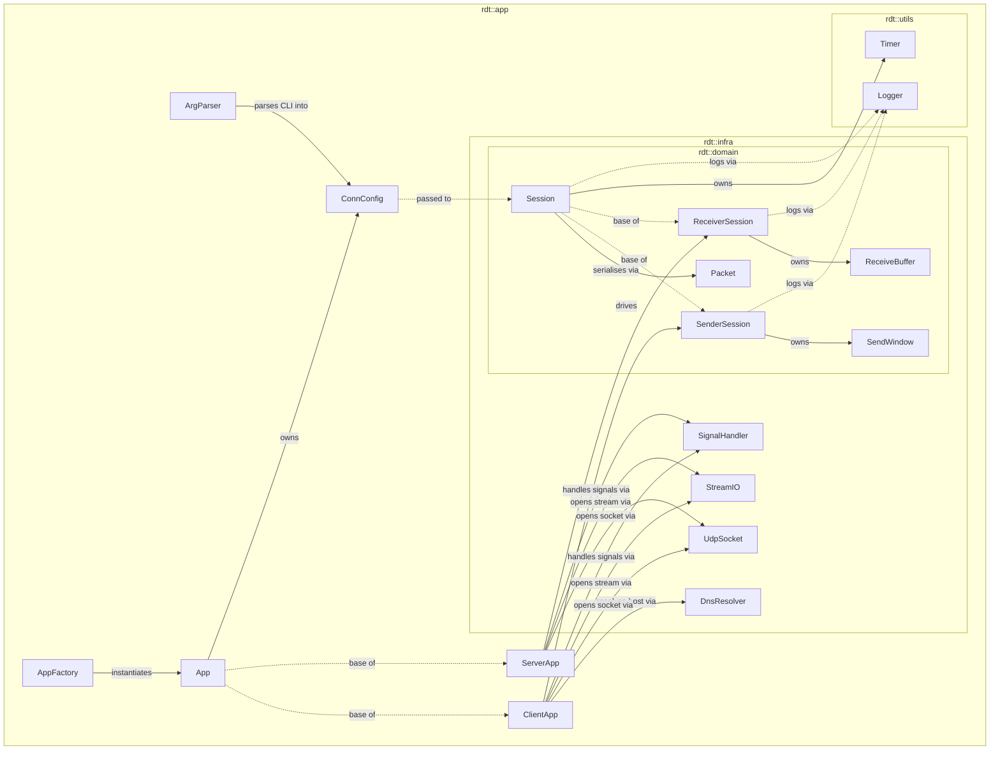
```mermaid 
flowchart TB

subgraph application["rdt::app"]

    ArgParser -->|parses CLI into| ConnConfig
    AppFactory -->|instantiates| App
    App -. base of .-> ClientApp
    App -. base of .-> ServerApp
    App -->|owns| ConnConfig

    subgraph infrastructure["rdt::infra"]
        UdpSocket
        StreamIO
        DnsResolver
        SignalHandler

        subgraph domain["rdt::domain"]
            Packet
            Session -->|serialises via| Packet
            Session -. base of .-> SenderSession
            Session -. base of .-> ReceiverSession
            SenderSession -->|owns| SendWindow
            ReceiverSession -->|owns| ReceiveBuffer
        end
    end

    subgraph utils["rdt::utils"]
        Logger
        Timer
    end

    ClientApp -->|resolves host via| DnsResolver
    ClientApp -->|opens socket via| UdpSocket
    ClientApp -->|opens stream via| StreamIO
    ClientApp -->|handles signals via| SignalHandler
    ClientApp -->|drives| SenderSession

    ServerApp -->|opens socket via| UdpSocket
    ServerApp -->|opens stream via| StreamIO
    ServerApp -->|handles signals via| SignalHandler
    ServerApp -->|drives| ReceiverSession

    ConnConfig -.->|passed to| Session
    Session -->|owns| Timer
    Session & SenderSession & ReceiverSession -.->|logs via| Logger
end
```

During early iterations, some cross-cutting components such as logging and timing were placed within the infrastructure layer. However, this proved to be a violation of the intended dependency direction, as these utilities were required across multiple layers, including the domain core.

As a result, they were extracted into a separate shared utility module (rdt::utils). While this refactoring was relatively straightforward, it served as a practical validation of the architectural boundaries and demonstrated how cross-cutting concerns can be cleanly isolated without compromising the dependency model.

Looking forward, if the system were to grow in complexity, an additional intermediate abstraction-such as a dedicated session orchestration layer-could be introduced between the application and domain layers. This would allow higher-level coordination logic to evolve independently from both protocol mechanics and application entry points.


### Key design decisions

**Signal handler (`SignalHandler`):**  
`SA_RESTART` is intentionally **not** set. Without it SIGINT/SIGTERM delivery causes `poll()` to return `EINTR` immediately; the event loop re-checks `stop_.load()` at the top of the next iteration and exits without delay. With `SA_RESTART` set, the kernel would transparently restart `poll()`, masking the signal until the next retransmit tick.

The handler sets an `std::atomic<bool>` with `memory_order_relaxed`. On x86_64 this compiles to a single `MOV`, which is intrinsically async-signal-safe. Rollback on partial failure (if `sigaction(SIGTERM)` fails after SIGINT was installed) restores the previous SIGINT disposition before throwing.

**Sequence number space:**  
Data sequence numbers are segment-indexed integers starting from 0, kept in a small integer space for easy SACK arithmetic. Connection ISNs (`isn_c`, `isn_s`) are independently random 32-bit values used only during the handshake. These two spaces are intentionally separate; incoming SYN-ACK packets are rejected in data-transfer states to prevent their ISN-based `ack_num` from corrupting the data window.

**Acknowledgment mechanism — cumulative ACK + SACK:**  
Cumulative ACK (the `ack_num` field) is the base reliability mechanism: every ACK asserts that all segments up to but not including `ack_num` have been received, giving the sender a single authoritative retransmission boundary. SACK blocks are layered on top to report out-of-order segments that arrived beyond the gap, so the sender can skip those when retransmitting and avoid redundant work. This combination was chosen over pure Go-Back-N (which would retransmit every in-flight segment on any loss) and over pure Stop-and-Wait (which provides no pipelining). Segment-indexed sequence numbers (described above) keep the SACK arithmetic simple and bounded.

**Implicit handshake ACK:**  
If the client's third-message ACK is dropped by the network, the server detects the inconsistency when the first data segment arrives while still in `SYN_RCVD`. Since a data segment proves the client received the SYN-ACK, the server treats it as an implicit handshake completion and falls through to normal data processing - preventing both sides from stalling.

**RAII throughout:** every OS resource (sockets, file descriptors, signal dispositions) is owned by a wrapper class and released in its destructor. No manual cleanup outside destructors.


#### Earlier Prototype Graphs
**Clean architecture Representation**
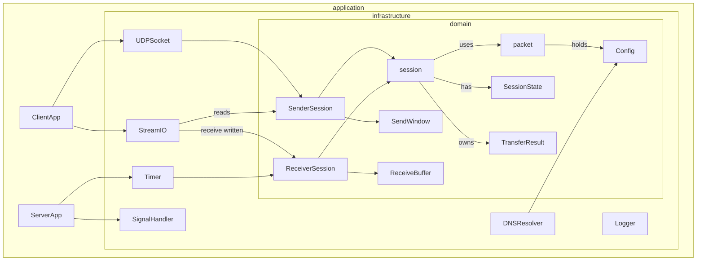
```mermaid
flowchart

subgraph application

    subgraph infrastructure

        subgraph domain
            session -->|uses| packet
            session -->|has| SessionState
            session -->|owns|TransferResult
            packet -->|holds|Config

            SenderSession-->session
            SenderSession-->SendWindow
            ReceiverSession-->session
            ReceiverSession-->ReceiveBuffer
        end

        DNSResolver --> Config
        Logger
        UDPSocket --> SenderSession
        StreamIO -->|reads|SenderSession
        StreamIO -->|receive written|ReceiverSession

        Timer --> ReceiverSession
        SignalHandler
    end
    ClientApp --> UDPSocket
    ClientApp --> StreamIO

    ServerApp --> Timer
    ServerApp --> SignalHandler
end
```

**Implementation Prototype** 

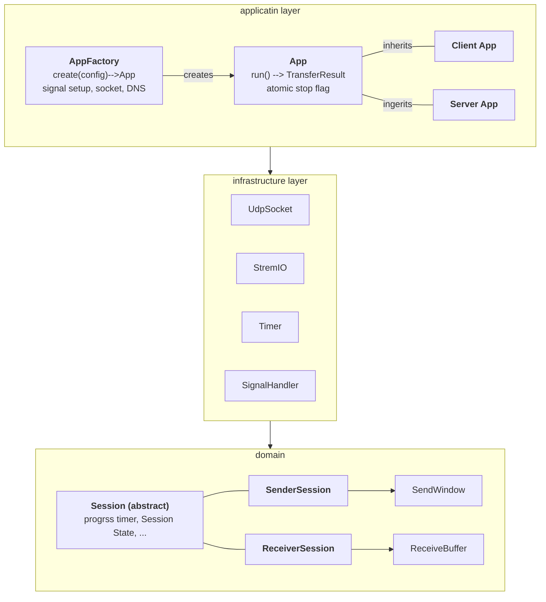
```mermaid
flowchart 
    subgraph AL [" applicatin layer"]
        app_factory["` **AppFactory**
            create(config)-->App
            signal setup, socket, DNS
        `"] -->|creates| app["`**App**
            run() --> TransferResult
            atomic stop flag
            `"]
        app---|inherits|client_app["`**Client App**`"]
        app---|ingerits|server_app["`**Server App**`"]
    end
    subgraph IL ["infrastructure layer"]
        UdpSocket
        StremIO
        Timer
        SignalHandler
    end
    subgraph domain
        session["` **Session (abstract)**
            progrss timer, Session State, ... 
            `"] --- ssession["`**SenderSession**`"]
        session --- rsession["`**ReceiverSession**`"]
        ssession-->SendWindow
        rsession --> ReceiveBuffer
    end

    AL --> IL
    IL --> domain
```

### Known deviation 
Session holds raw fd and calls POSIX I/O directly. Intended design was UdpSocket owning and driving the session loop, with I/O routed through send_pkt/recvfrom_pkt. Refactor if transport-layer abstraction (mock sockets, per-socket logging) is ever needed.

### Packet / Header Format
Every PDU is carried inside a single UDP datagram. The maximum UDP payload size is 1200 bytes (hard limit per assignment). The fixed header is 20 bytes; a variable SACK extension of up to 15 × 4 bytes may follow; then the payload.

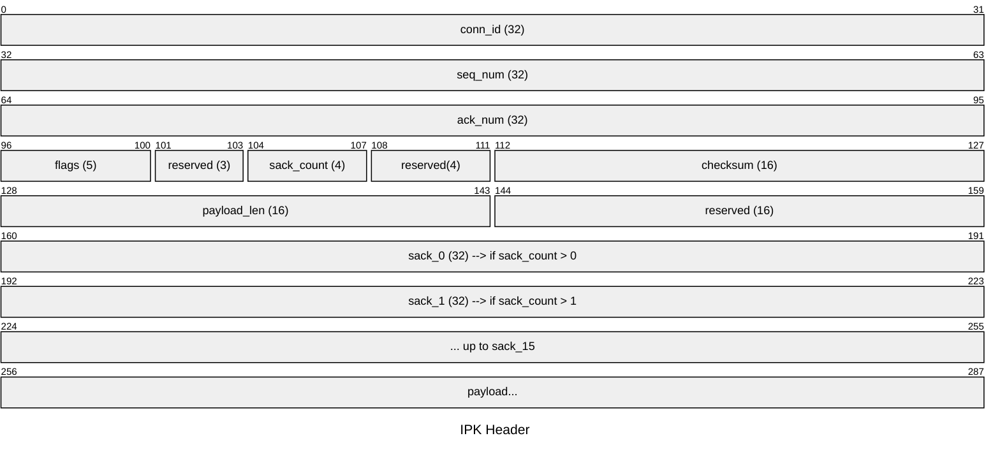
```mermaid
packet-beta
title IPK Header
0-31: "conn_id (32)"
32-63: "seq_num (32)"
64-95: "ack_num (32)"
96-100: "flags (5)"
101-103: "reserved (3)"
104-107: "sack_count (4)"
108-111: "reserved(4)"
112-127: "checksum (16)"
128-143: "payload_len (16)"
144-159: "reserved (16)"
160-191: "sack_0 (32) --> if sack_count > 0"
192-223: "sack_1 (32) --> if sack_count > 1"
224-255: "... up to sack_15"
256-287: "payload..."
```
All multi-byte fields are in network byte order (big-endian).

#### Flags
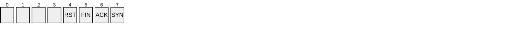
```mermaid
packet-beta
0-0: ""
1-1: ""
2-2: ""
3-3: ""
4-4: "RST"
5-5: "FIN"
6-6: "ACK"
7-7: "SYN"
```

All empty are reserved for other potential flags 

#### Field Summary
| Field | Size | Description |
|---|---|---|
| `conn_id` | 32 bit | Random connection identifier, set by client at session start |
| `seq_num` | 32 bit | Sequence number of this segment (data) or ISN (handshake) |
| `ack_num` | 32 bit | Cumulative ACK: next expected seq from the peer |
| `flags` | 8 bit | SYN / ACK / FIN / RST |
| `sack_count` | 4 bit | Number of SACK blocks that follow (0–15) |
| `checksum` | 16 bit | RFC 1071 Internet checksum over the entire PDU (header + payload) |
| `payload_len` | 16 bit | Payload byte count |
| `sack_blocks` | 0–60 B | Sequence numbers of out-of-order segments already buffered |

**Maximum payload per segment:**

- With no SACK blocks: 1200 − 20 = **1180 bytes** (typical)
- With 15 SACK blocks: 1200 − 20 − 60 = **1120 bytes** (worst case)

---

### Integrity Protection

Every PDU carries an RFC 1071 Internet checksum computed over the entire PDU (header + payload) with the checksum field set to zero. On receive, the checksum is recomputed over the full datagram (including the received checksum field); a valid PDU produces `0x0000`. Packets that fail this check are silently discarded.

---

### Connection Identification

The client generates a random 32-bit `conn_id` at startup (using a seeded Mersenne-Twister RNG). `conn_id` is embedded in the SYN and adopted by the server for all subsequent packets. Every incoming packet that does not match the current session's `conn_id` is silently dropped (except during the initial LISTENING state where no `conn_id` is yet known).

---

### Session Lifecycle

The protocol has three phases: **Handshake → Data Transfer → Teardown**.

#### Handshake (3-way)

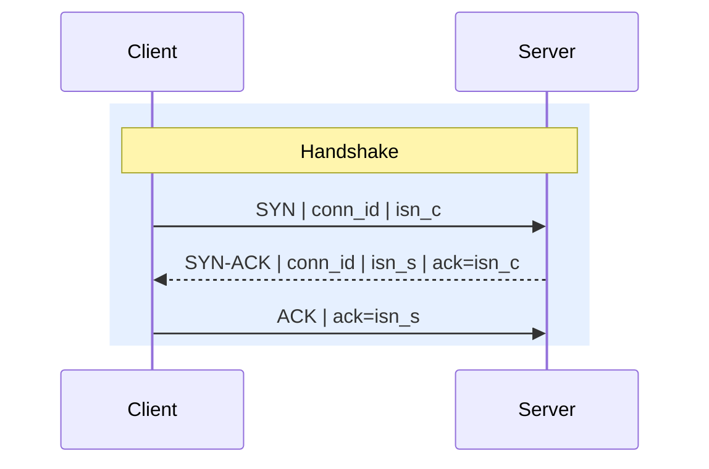
```mermaid
sequenceDiagram
    participant C as Client
    participant S as Server

    rect rgb(230, 240, 255)
        Note over C,S: Handshake
        C->>S: SYN | conn_id | isn_c
        S-->>C: SYN-ACK | conn_id | isn_s | ack=isn_c
        C->>S: ACK | ack=isn_s
    end
```

- The client's SYN carries its random ISN (`isn_c`) and the generated `conn_id`.
- The server's SYN-ACK carries its own random ISN (`isn_s`) and acknowledges `isn_c`.
- The client's ACK completes the handshake; data transfer starts immediately.
- **Robustness:** if the client's ACK is lost under network impairment, the server recognises the first incoming data segment as an implicit ACK and transitions to the data-transfer state automatically.

#### Data Transfer

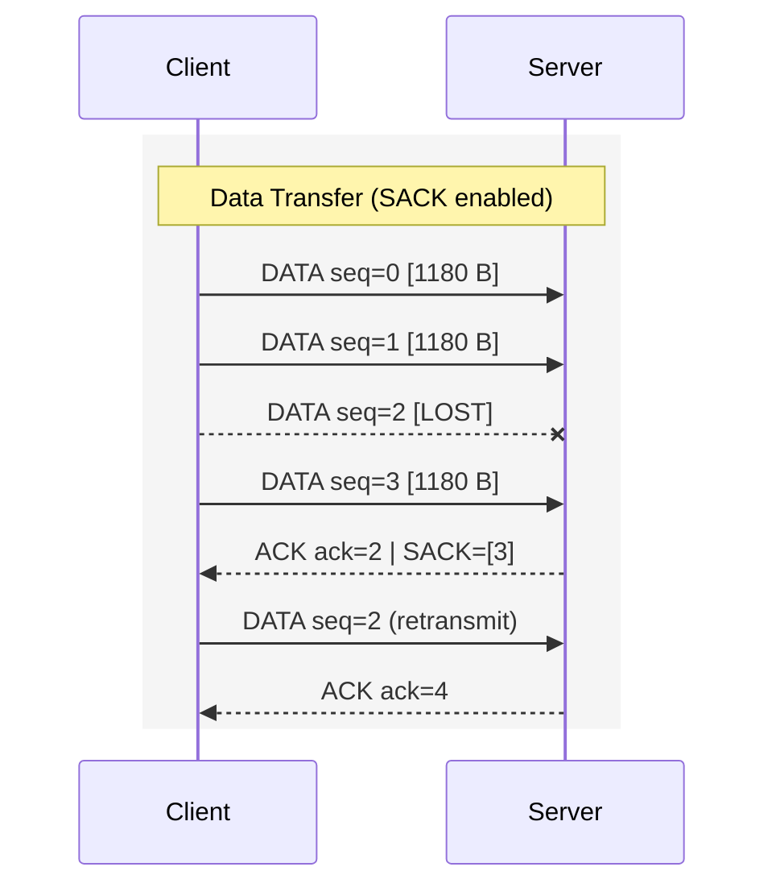
```mermaid
sequenceDiagram
    participant C as Client
    participant S as Server

    rect rgb(245, 245, 245)
        Note over C,S: Data Transfer (SACK enabled)
        C->>S: DATA seq=0 [1180 B]
        C->>S: DATA seq=1 [1180 B]
        C--xS: DATA seq=2 [LOST]
        C->>S: DATA seq=3 [1180 B]
        S-->>C: ACK ack=2 | SACK=[3]
        C->>S: DATA seq=2 (retransmit)
        S-->>C: ACK ack=4
    end
```

#### Teardown (4-way)

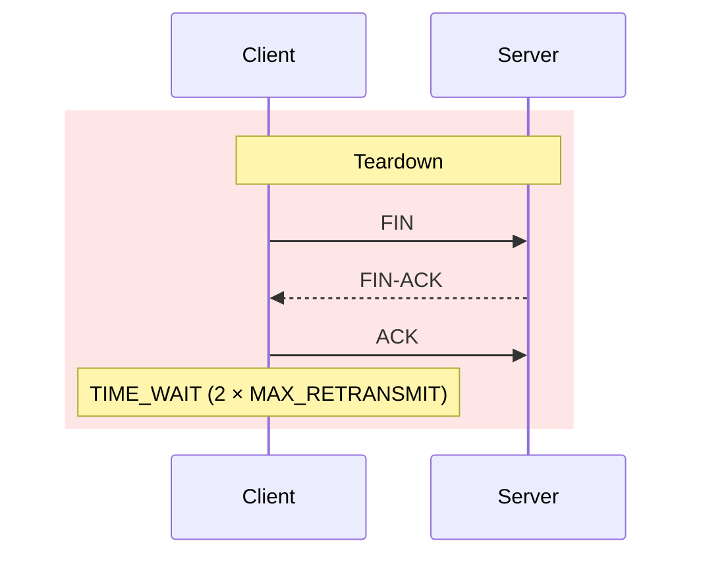
```mermaid
sequenceDiagram
    participant C as Client
    participant S as Server

    rect rgb(255, 230, 230)
        Note over C,S: Teardown
        C->>S: FIN
        S-->>C: FIN-ACK
        C->>S: ACK
        Note over C: TIME_WAIT (2 × MAX_RETRANSMIT)
    end
```

The client enters `TIME_WAIT` for `2 × MAX_RETRANSMIT_MS` (6 seconds) to absorb any delayed FIN-ACK retransmits from the server. The progress timeout is not enforced during `TIME_WAIT` because it is a deliberate waiting state.

#### Lifecycle of Communication 
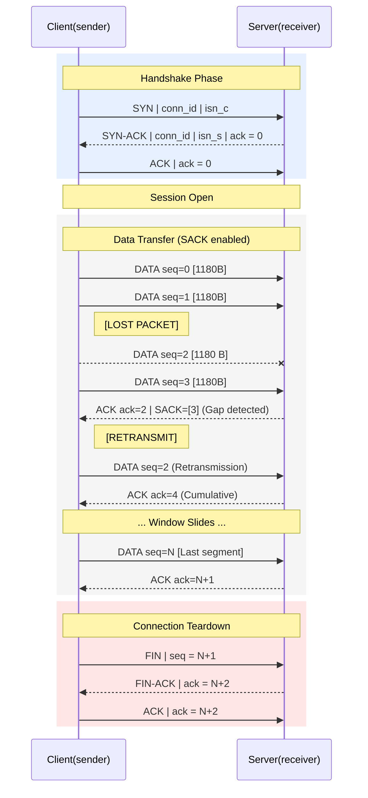
```mermaid 
sequenceDiagram
    participant C as Client(sender)
    participant S as Server(receiver)

    %%% HANDSHAKE
    rect rgb(230, 240, 255)
        Note over C,S: Handshake Phase
        C->>S: SYN | conn_id | isn_c
        S-->>C: SYN-ACK | conn_id | isn_s | ack = 0
        C->>S: ACK | ack = 0
    end
    
    Note over C,S: Session Open

    %% DATA TRANSFER
    rect rgb(245, 245, 245)
        Note over C,S: Data Transfer (SACK enabled)
        C->>S: DATA seq=0 [1180B]
        C->>S: DATA seq=1 [1180B]
        
        Note right of C: [LOST PACKET]
        C--xS: DATA seq=2 [1180 B]
        
        C->>S: DATA seq=3 [1180B]
        S-->>C: ACK ack=2 | SACK=[3] (Gap detected)
        
        Note right of C: [RETRANSMIT]
        C->>S: DATA seq=2 (Retransmission)
        
        S-->>C: ACK ack=4 (Cumulative)
        
        Note over C,S: ... Window Slides ...
        
        C->>S: DATA seq=N [Last segment]
        S-->>C: ACK ack=N+1
    end

    %%% TEARDOWN 
    rect rgb(255, 230, 230)
        Note over C,S: Connection Teardown
        C->>S: FIN | seq = N+1
        S-->>C: FIN-ACK | ack = N+2
        C->>S: ACK | ack = N+2
    end
```

---

### State Machines

#### Client (sender)

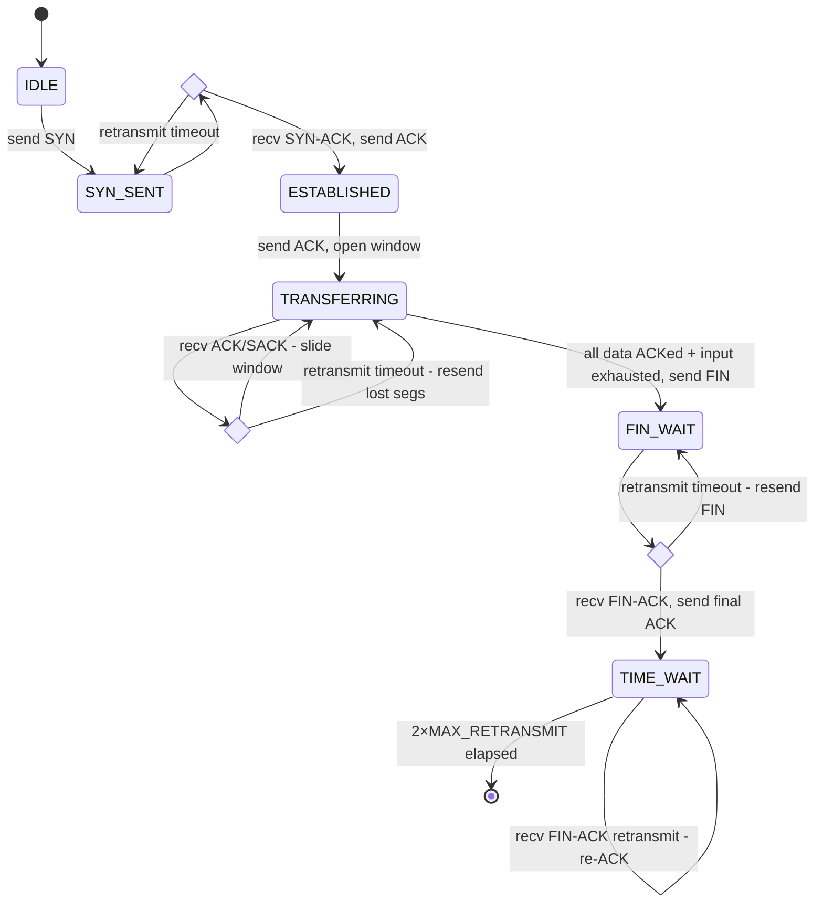
```mermaid
stateDiagram-v2
    state syn_choice <<choice>>
    state fin_choice <<choice>>
    state trans_choice <<choice>>

    [*] --> IDLE
    IDLE --> SYN_SENT : send SYN
    SYN_SENT --> syn_choice
    syn_choice --> ESTABLISHED : recv SYN-ACK, send ACK
    syn_choice --> SYN_SENT : retransmit timeout
    ESTABLISHED --> TRANSFERRING : send ACK, open window
    TRANSFERRING --> trans_choice
    trans_choice --> TRANSFERRING : recv ACK/SACK - slide window
    trans_choice --> TRANSFERRING : retransmit timeout - resend lost segs
    TRANSFERRING --> FIN_WAIT : all data ACKed + input exhausted, send FIN
    FIN_WAIT --> fin_choice
    fin_choice --> TIME_WAIT : recv FIN-ACK, send final ACK
    fin_choice --> FIN_WAIT : retransmit timeout - resend FIN
    TIME_WAIT --> TIME_WAIT : recv FIN-ACK retransmit - re-ACK
    TIME_WAIT --> [*] : 2×MAX_RETRANSMIT elapsed
```

#### Server (receiver)

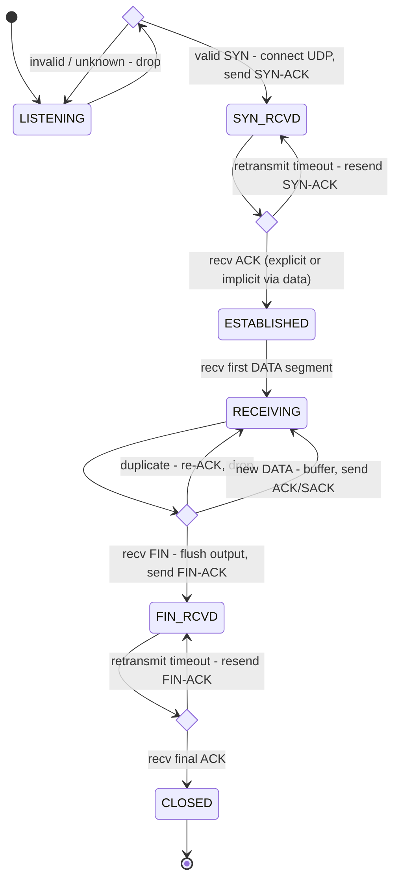
```mermaid
stateDiagram-v2
    state listen_choice <<choice>>
    state syn_choice <<choice>>
    state receive_choice <<choice>>
    state fin_choice <<choice>>

    [*] --> LISTENING
    LISTENING --> listen_choice
    listen_choice --> LISTENING : invalid / unknown - drop
    listen_choice --> SYN_RCVD : valid SYN - connect UDP, send SYN-ACK
    SYN_RCVD --> syn_choice
    syn_choice --> SYN_RCVD : retransmit timeout - resend SYN-ACK
    syn_choice --> ESTABLISHED : recv ACK (explicit or implicit via data)
    ESTABLISHED --> RECEIVING : recv first DATA segment
    RECEIVING --> receive_choice
    receive_choice --> RECEIVING : duplicate - re-ACK, drop
    receive_choice --> RECEIVING : new DATA - buffer, send ACK/SACK
    receive_choice --> FIN_RCVD : recv FIN - flush output, send FIN-ACK
    FIN_RCVD --> fin_choice
    fin_choice --> FIN_RCVD : retransmit timeout - resend FIN-ACK
    fin_choice --> CLOSED : recv final ACK
    CLOSED --> [*]
```

---

### Sequencing and Acknowledgement Strategy

- **Cumulative ACK** is the base mechanism. The `ack_num` in every server-to-client packet is the next expected sequence number (i.e., all segments with `seq < ack_num` have been delivered in order to the application).
- **SACK extension** piggybacks up to 15 sequence numbers of out-of-order segments that are already buffered. The sender uses this to skip retransmission of segments the receiver already has (Selective Repeat).
- Data segment sequence numbers are **segment-indexed** (0, 1, 2, …), not byte-indexed. One segment equals one UDP datagram.

---

### Retransmission Strategy and Timeout Handling

| Parameter | Value |
|---|---|
| Initial retransmit interval | 200 ms |
| Backoff multiplier | ×2 per consecutive timeout |
| Maximum retransmit interval | 3000 ms |
| Progress timeout (`-w`) | user-configurable, default 1 s |

- **Control packets** (SYN, SYN-ACK, FIN, FIN-ACK) use a shared per-session cached-retransmit timer with exponential backoff.
- **Data segments** each carry their own `Timer`. When a segment's timer expires and it is not SACK-marked, it is added to the retransmit queue. Only missing segments are retransmitted (Selective Repeat, not Go-Back-N).
- **Progress timeout** (`-w TIMEOUT`): if no event that advances protocol state (new ACK, new data, handshake or teardown step) is observed for `TIMEOUT` seconds, the session terminates with a non-zero exit code. Duplicates and retransmissions do **not** count as progress. The `TIME_WAIT` state is exempt from the progress timeout since it has its own fixed duration.
- The event loop polls with a `RETRANSMIT_MS`-millisecond timeout so retransmits fire even when no packets arrive.

---

### Duplicate and Out-of-Order Packet Handling

**Receiver (server):**

- The `ReceiveBuffer` is a map keyed by segment sequence number, sized to the window.
- Segments arriving with `seq < next_expected` (already delivered) or already present in the buffer return `DUPLICATE`. A re-ACK with current SACK state is sent so the sender does not unnecessarily retransmit segments the receiver already has.
- Segments arriving outside the receive window (`seq >= next_expected + window_size`) are discarded as `INVALID`.
- `drain()` walks the buffer from `next_expected` forward and delivers any contiguous run to the output stream in order, advancing `next_expected`.

**Sender (client):**

- Duplicate ACKs (same `ack_num` as current window base) are silently ignored by `on_ack()` returning 0.
- Duplicate SYN-ACK packets arriving while the sender is in `TRANSFERRING` state are detected by their `SYN` flag and dropped before reaching `on_ack()`, preventing corruption of the data window (the SYN-ACK's `ack_num` is the random ISN, not a data offset).
- SACK-marked segments are skipped in retransmit candidate selection.

---

### Segment Size and Window Behaviour

| Parameter | Value |
|---|---|
| Max UDP payload | 1200 bytes |
| Typical segment payload | 1180 bytes (no SACK) |
| Minimum segment payload | 1120 bytes (15 SACK blocks) |
| Window size | 30 segments |
| Max in-flight data | 30 × 1180 ≈ 34.6 KB |

The window is **send-side only** (the client's `SendWindow`). Segments are pushed into the window until it is full (`next_seq − base ≥ window_size`). As cumulative ACKs arrive the base slides forward, making room for new segments. The receiver's `ReceiveBuffer` is sized identically to prevent the sender from overfilling it.


--- 

## Testing

### Unit tests

```sh
make test
```

Catch2 unit tests cover: packet serialisation/deserialisation, checksum correctness, `SendWindow` (push, cumulative ACK, SACK marking, retransmit candidates), `ReceiveBuffer` (in-order, out-of-order, duplicate, window boundary), DNS resolver, and UDP socket binding.

### End-to-end integration tests

```sh
make e2e
```

Tests run on the loopback interface without network impairment. All 14 scenarios pass:

| Scenario | Result |
|---|---|
| Empty input (file→file) | PASS |
| Small text (file→file) | PASS |
| Binary 4 KB (file→file) | PASS |
| Binary 1 MB (file→file) | PASS |
| Binary 50 MB (file→file) | PASS |
| Empty input (stdin→stdout) | PASS |
| Small text (stdin→stdout) | PASS |
| Binary 1 MB (stdin→stdout) | PASS |
| Binary 1 MB (stdin→file) | PASS |
| Binary 1 MB (file→stdout) | PASS |
| Small text IPv6 | PASS |
| Binary 1 MB IPv6 | PASS |
| Client exits non-zero (no server) | PASS |
| Server exits non-zero (no client, timeout) | PASS |

### Network-impairment tests (tc-netem)

```sh
make netem   # requires root / sudo
```

All 15 scenarios pass under controlled network impairment on the loopback interface:

| Condition | File size | Timeout | Result |
|---|---|---|---|
| 5% packet loss | small text | 15 s | PASS |
| 5% packet loss | 1 MB | 30 s | PASS |
| 10% packet loss | 1 MB | 45 s | PASS |
| 20% packet loss | 4 KB | 30 s | PASS |
| 20% packet loss | 1 MB | 60 s | PASS |
| 10% packet duplication | 1 MB | 20 s | PASS |
| 30% packet duplication | 1 MB | 20 s | PASS |
| 25% reorder + 20 ms base delay | 4 KB | 20 s | PASS |
| 25% reorder + 20 ms base delay | 1 MB | 30 s | PASS |
| 50% reorder + 10 ms base delay | 1 MB | 30 s | PASS |
| 30 ms fixed delay | 1 MB | 20 s | PASS |
| 50 ms ± 20 ms jitter (normal dist.) | 1 MB | 30 s | PASS |
| 5% loss + 20% reorder + 30 ms ± 15 ms | 4 KB | 30 s | PASS |
| 5% loss + 20% reorder + 30 ms ± 15 ms | 1 MB | 60 s | PASS |
| 10% loss + 5% dup + 50 ms delay | 1 MB | 60 s | PASS |


### Network speed tests
```
═══════════════════════════════════════════
 ipk-rdt — throughput / speed tests
═══════════════════════════════════════════

Generating test inputs...

--- Clean loopback (no impairment) ---
PASS  loopback  1 MB                                    1 MB    0.12 s    8.13 MB/s  (min 2.00)
PASS  loopback 10 MB                                   10 MB    0.26 s   38.76 MB/s  (min 5.00)
PASS  loopback 50 MB                                   50 MB    0.92 s   54.29 MB/s  (min 10.00)

--- Fixed delay ---
PASS  10 ms delay  1 MB                                 1 MB    0.76 s    1.32 MB/s  (min 0.50)
PASS  30 ms delay  1 MB                                 1 MB    2.06 s    0.48 MB/s  (min 0.15)

--- Delay + jitter ---
PASS  30ms +/-15ms jitter  1 MB                         1 MB    2.14 s    0.47 MB/s  (min 0.10)

--- Loss + delay ---
PASS  5% loss + 30ms delay  1 MB                        1 MB    4.54 s    0.22 MB/s  (min 0.05)
PASS  10% loss + 30ms delay  1 MB                       1 MB    7.09 s    0.14 MB/s  (min 0.03)

═══════════════════════════════════════════
Results:  8 passed  0 failed
═══════════════════════════════════════════

```
**Test environment:** Tested for OS neutrality via NixOS (NixDevShell) and natively on x86\_64-linux (CachyOS 6.19.12), loopback, `tc` from iproute2-7.0.0. All tests run `diff -q` on input and output to verify byte-for-byte integrity.

---
## Known Limitations
- **No sub-second timeout granularity** - -w only accepts whole seconds, so a test with -w 1 and a 200 ms retransmit base is tight (TODO: we could do this just for the funsies)
- **Fixed window size** - no dynamic window sizing or receiver-advertised window; if the receiver is slow the sender doesn't back off
- **No ICMP error handling** - if a server is unreachable, the client relies entirely on the progress timeout rather than detecting the ICMP port-unreachable immediately
- **High loss rates (>40%)** - at extreme loss, the exponential backoff can push retransmit intervals to 3 s, meaning a -w 5 timeout leaves little margin for repeated losses on the same segment

- **Single-client server:** the server accepts exactly one session per process run. Concurrent clients are not supported.
- **No congestion control:** the window size is fixed at 30 segments. There is no AIMD or BBR-style congestion avoidance.
- **No partial-transfer resume:** if the process is killed mid-transfer, the transfer must be restarted from the beginning.
- **No bidirectional transfer:** data flows client → server only within a single session.
- **Sequence numbers are segment-indexed, not byte-indexed:** this simplifies SACK arithmetic but makes the protocol incompatible with byte-stream-oriented analysers.
- **Violation of Pure Clean Architecture** - App directly touches Session, which is 2 layer jump. This violation of architecture is pretty well contained and if there would be the need to have better architecture, introduction of thin ITransport interface shouldn't take long. 
---
## References


1. Postel, J. *User Datagram Protocol*. RFC 768. IETF, 1980.
2. Eddy, W. (ed.). *Transmission Control Protocol (TCP)*. RFC 9293. IETF, 2022.
3. Paxson, V. et al. *Computing TCP's Retransmission Timer*. RFC 6298. IETF, 2011.
4. Kurose, J. F. and Ross, K. W. *Computer Networking: A Top-Down Approach*. 8th ed. Pearson, 2021.
5. Linux `tc-netem(8)` manual page. iproute2.
6. STÁHL, Peter. FIT_PROJECTS - prior coursework repository [own work] Available at: https://github.com/stahlgit/FIT_PROJECTS
7. Port Scanning Techniques - UDP Scan. Nmap Network Scanning. Available at: https://nmap.org/book/scan-methods-udp-scan.html
8. Stack Overflow: C++ alternative to perror. Available at: https://stackoverflow.com/questions/3320898/c-alternative-to-perror
9. Stack Overflow: How to overload a function taking variable number of arguments. Available at: https://stackoverflow.com/questions/66778684/how-to-overload-a-function-taking-variable-number-of-arguments
10. Claude (Anthropic). AI assistant used for test generation, documentation, Makefile, research for RFC correctness

