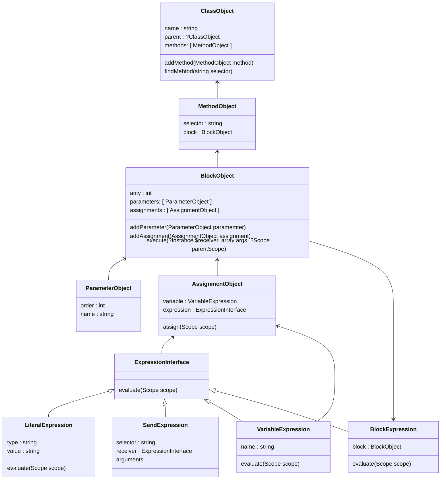
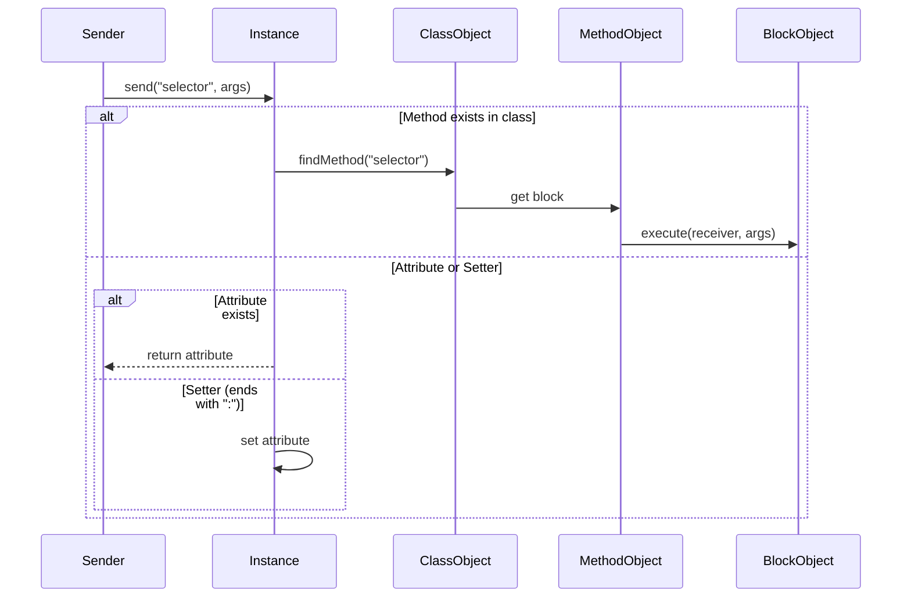
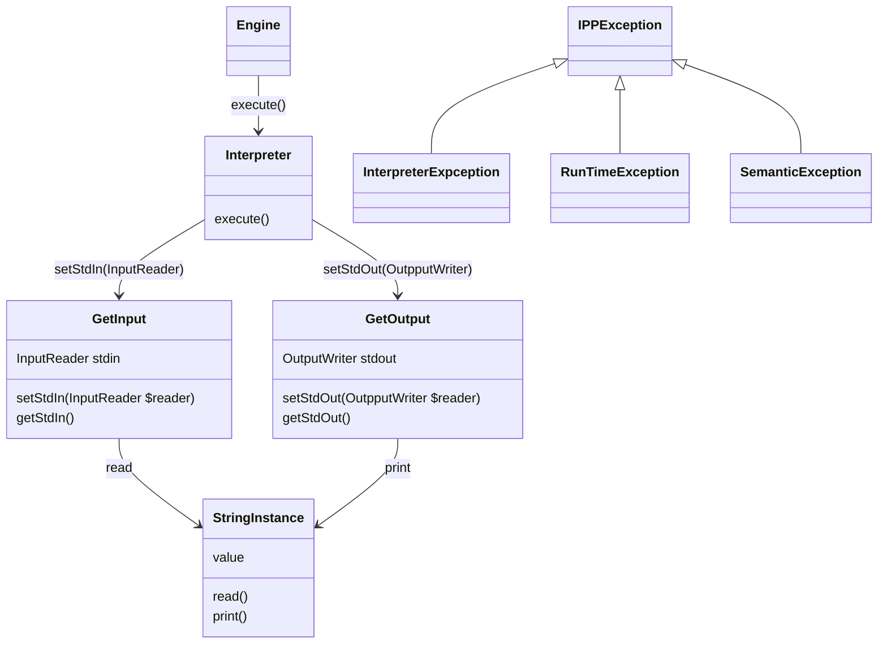

Implementační dokumentace k 2. úloze do IPP 2024/2025
Jméno a příjmení: Peter Stahl
Login: xstahl01

## Design Philosophy
The architecture of the interpreter is centered around the Abstract Syntax Tree (AST) representation of the SOL25 language. The core strategy involves traversing this tree and constructing objects that represent each node of the AST. This object-oriented design allows for dynamic and modular runtime behavior that mirrors the structure of SOL25 programs.

Given that SOL25 is composed entirely of basic commands defined in built-in classes, the interpreter evaluates blocks of methods by building an object tree from the AST and executing it through these runtime representations. Each node in the AST becomes a corresponding runtime instance, enabling the system to emulate SOL25's semantics effectively and modularly.


## Internal Representation
The interpreter is implemented as a tree-walk interpreter, designed using object-oriented principles. It parses an XML input representing the AST of the program and transforms it directly into a tree of class instances. This structure is then evaluated using built-in classes and methods defined by the SOL25 language. 
### Key design principles:
- **Object-Centric Semantics** 
  - All built-in SOL25 classes inherit from a base Object, and runtime behavior is defined by instantiating these class representations during execution.
- **Pattern-Driven**: 
  - *Visitor Pattern* : Used for AST traversal and child-node processing.
  - *Builder Pattern* : Applied in constructing node and instance representations of program components.
  - *Singleton Pattern* : Used for unique instances such as Nil, ensuring only one exists.

 
- **Dynamic Dispatch**:
  - Method resolution is performed at runtime through selector matching, enabling polymorphic behavior in expression evaluation. 

### AST Traversal


## Key Algorithms
### AST Traversal
The interpreter uses a Depth-First Search (DFS) approach to traverse the AST. This ensures that child expressions and statements are evaluated before their parent nodes, preserving correct execution order. Each node type (e.g., expression, method, block) is recursively visited, and object instances are constructed accordingly.

### Method dispatch 
Expression evaluation heavily relies on dynamic dispatch. Method invocation is handled via selector matching on the receiver object at runtime.


#### Method Dispatch Optimization
To reduce overhead, method lookups can be cached after their first resolution. This accelerates repeated method calls and minimizes traversal of the class hierarchy.
```
// Instance.php excerpt
public function send(string $selector, array $args): mixed {
    // 1. Special case handlers (e.g., identity check)
    // 2. Direct attribute access
    // 3. Setter detection
    // 4. Class method lookup
    $method = $this->class->findMethod($selector);
    // ... execute block with arity check
}

```

### Block evaluation
A block represents the actual logic behind method calls. The interpreter performs the following steps to evaluate a block:
  1. Create a new scope, inheriting from the parent.
  2. Bind parameters by declaration order into the scope.
  3. Freeze the self reference for the block.
  4. Execute assignments sequentially.
  5. Return the result of the last assignment or the result variable if explicitly defined.


#### Instance Creation

1. Built-in Instances:
 - Initialized once during interpreter startup.
 - Represent base classes such as Object, Integer, String, etc.

2. Primitive Instances (Integer/String):
 - Created via `BuiltInFactory::create(type, value)`
 - Example: `BuiltInFactory::create('Integer', '5').`

3. User-Defined Instances:
- Created via new or from: methods:
```console
$instance = $classObject->send('new', []); // Default initialization
$instance = $classObject->send('from:', [$argInstance]); // With value
```

### Block Execution Flow
 1. Create new scope inheriting from parent
 2. Bind parameters in declaration order
 3. Execute assignments sequentially 
 4. Return `result` variable value 
   - Local Scope: Block parameters and assignments
   - Instance Scope: Object attributes
   - Global Scope: Built-in classes
  
### Scope Management
The Scope class manages variable bindings using lexical scoping. It supports:
- Read-only bindings for block parameters.
- Parent scope references for late-bound variable lookup.
- Hierarchical variable resolution:
    - Local Scope → Parameters and assignments.
    - Instance Scope → Object attributes.
    - Global Scope → Built-in class references.


## ipp-core Extensions 
The interpreter integrates with the provided IPP core through standard input/output extensions and custom exception classes.
### Input/Output Handling
- **InputReader**: The interpreter accepts an InputReader instance for reading inputs using the read method.
- **OutputWriter**: Outputs are handled through the print method. If no OutputWriter is provided, it falls back to echo.
### Exception Handling
The interpreter introduces three custom exceptions extending the IPPException class:
- **InterpreterException**: General interpreter logic errors.
- **RuntimeException**: Errors encountered during program execution (e.g., type errors).
- **SemanticException**: Errors related to incorrect usage of the language constructs.



## Coding Standards and Static Analysis

This project adheres to the following PHP standards and utilizes static analysis tools to ensure code quality and consistency:

* **PSR-1: Basic Coding Standard:** This standard outlines the fundamental requirements for PHP code, including file naming conventions, class and method naming, and the use of namespaces.
* **PSR-4: Autoloader:** This specification details how to structure PHP code for autoloading, allowing for the efficient and organized inclusion of class files.
* **PSR-12: Extended Coding Style:** Building upon PSR-1, this standard provides further guidelines on code formatting, such as indentation, line length, and control structure syntax, promoting readability and uniformity across the codebase.

In addition to these standards, we employ static analysis to proactively identify potential issues and enforce coding best practices:

* **PHPStan:** This powerful static analysis tool examines the codebase without executing it, detecting errors related to type hints, undefined variables, incorrect method calls, and more. It helps us catch bugs early in the development cycle and improve the overall robustness of our code.
* **PhpStorm Code Analysis:** The built-in code analysis features of PhpStorm are also utilized to highlight potential problems, suggest improvements, and ensure adherence to coding standards as we write code.
