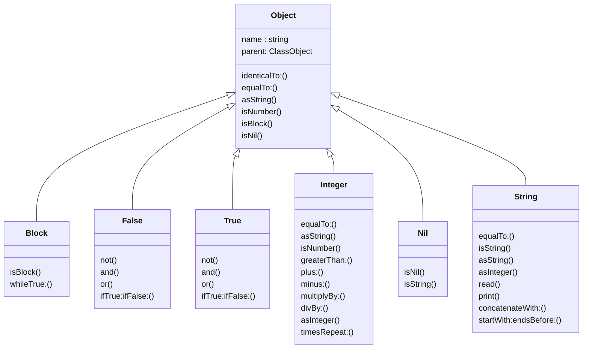
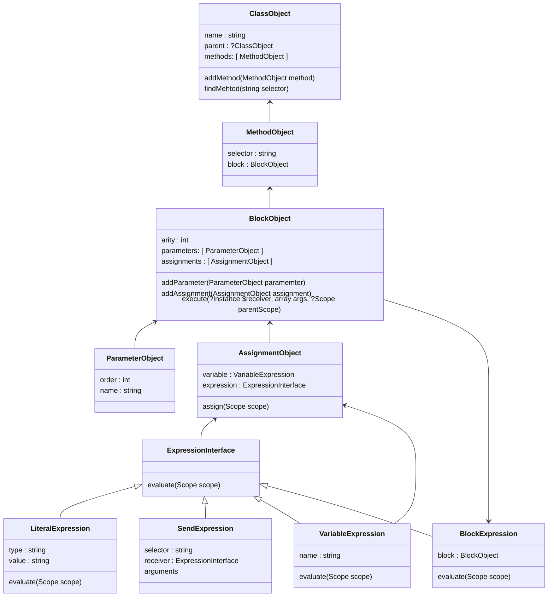
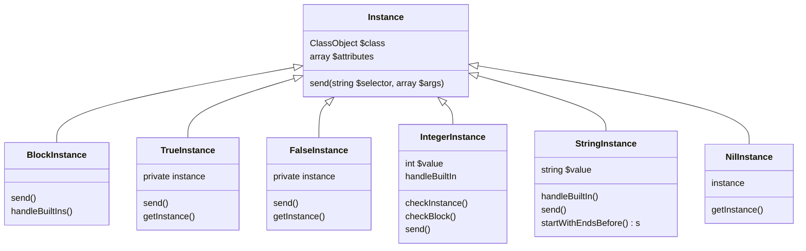
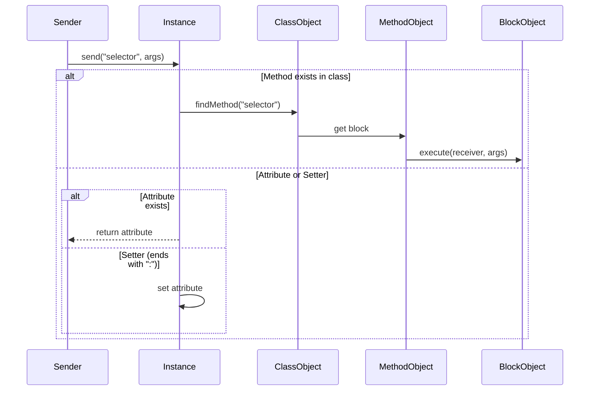
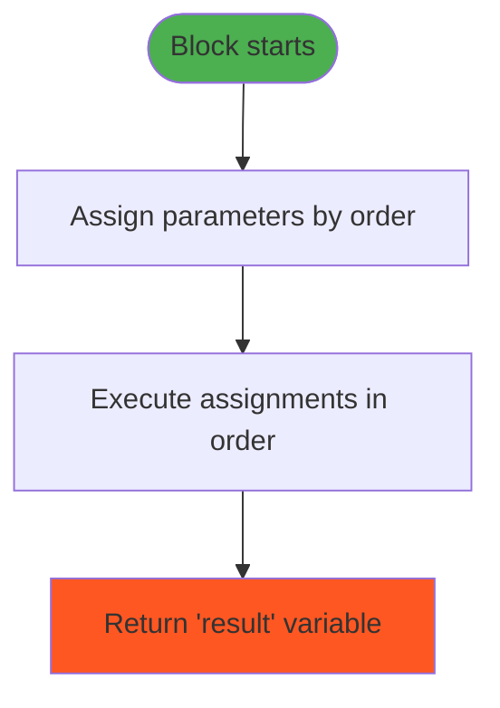

### Built in classes




### AST architecture 




#### Runtime Architecture
Get Instance and instance is used for singletons (I think) --> aka when is just one and same instance of that 

Instance Creation

1. Built-in Instances (True/False/Nil/Block):
 - Singletons created via getInstance() (e.g., T-rueInstance::getInstance()).
 - Initialized once during interpreter setup.

2. Primitive Instances (Integer/String):
 - Created via BuiltInFactory::create(type, value).
 - Example: BuiltInFactory::create('Integer', '5').

3. User-Defined Instances:
- Created via new or from: methods:
```console
$instance = $classObject->send('new', []); // Default initialization
$instance = $classObject->send('from:', [$argInstance]); // With value
```

The runtime system handles object instantiation, method dispatch, block execution, and scope management through several key components working together. The execution flow starts with the Main class' run method and propagates through nested message sends.



##### Block Execution
 - Parameters:
   - Sorted by order attribute during XML parsing.
   - Mapped to arguments during block execution.
 - Scope:
   - Each block has a Scope object for local variables.
   - Inherits from parent scope (closure).



K objektovému návrhu
a implementaci je samozřejmě povinné sepsat také stručnou a terminologicky správnou dokumentaci
uvádějící, jak jste rámec ipp-core pro splnění zadání použili/rozšířili.

